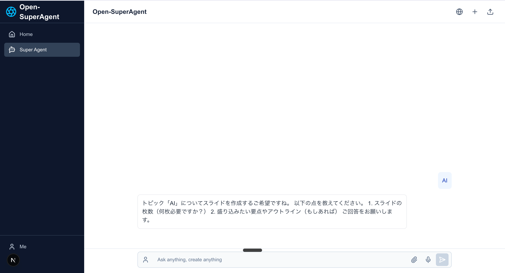

# Open-SuperAgent

AIアシスタント機能を備えたオープンソースチャットアプリケーション。Mastraエージェントと連携して、様々なタスクを自動化します。



## 🚀 すぐに試してみる（無料）

**最初は無料のAPIキーだけで、AIチャットと検索機能を体験できます！**

### 必要な無料APIキー（2つだけ）

1. **Google Gemini API（無料）**
   - [Google AI Studio](https://aistudio.google.com/app/apikey) にアクセス
   - Googleアカウントでサインイン
   - "Create API Key" をクリック
   - **無料枠**: 1分間あたり最大15リクエスト、1日1,500リクエストまで無料

2. **Brave Search API（無料）**
   - [Brave Search API](https://api.search.brave.com/app/keys) にアクセス
   - アカウント作成（GitHubアカウントでも可）
   - "Create new key" をクリック
   - **無料枠**: 月間2,000クエリまで無料

### クイックスタート

```bash
# リポジトリをクローン
git clone https://github.com/nanameru/Open_SuperAgent.git
cd Open_SuperAgent

# 依存パッケージをインストール
npm install

# 環境変数ファイルをコピー
cp .env.example .env

# .envファイルを編集して、上記2つのAPIキーを設定
# GOOGLE_GENERATIVE_AI_API_KEY=取得したGeminiのAPIキー
# GEMINI_API_KEY=同じGeminiのAPIキー（両方に設定）
# BRAVE_API_KEY=取得したBrave SearchのAPIキー

# Mastraサーバーを起動（別ターミナルで）
mastra dev

# 開発サーバーを起動
npm run dev
```

ブラウザで http://localhost:3000 を開いて、AIチャットと検索を試してみましょう！

### 無料で使える機能

- ✅ **AIチャット**: Google Gemini 2.5 Flashによる高速な応答
- ✅ **Web検索**: Brave Searchを使った最新情報の検索
- ✅ **タスクプランニング**: 複数のタスクを効率的に実行
- ✅ **並列処理**: 独立したタスクを同時実行で高速化

他の機能（画像生成、音声生成、ブラウザ自動化など）を使いたい場合は、該当するAPIキーを追加で設定してください。

## 主な機能

- **AIチャット**: シンプルで使いやすいチャットインターフェース
- **ツール実行**: Mastraエージェントを活用した各種タスクの自動化
- **ツール実行の可視化**: Mastraエージェントのツール実行状況をリアルタイムに表示
- **レスポンシブデザイン**: モバイルからデスクトップまで対応したUI
- **音声生成**: MiniMax T2A Large v2 APIを使用した高品質な音声合成

## 技術スタック

- **フロントエンド**: Next.js 15、TailwindCSS、Vercel AI SDK
- **バックエンド**: Mastraエージェントフレームワーク
- **音声生成**: MiniMax T2A Large v2 API
- **デプロイ**: Vercel

## 音声生成機能（MiniMax TTS）

### 概要
MiniMax T2A Large v2 APIを使用した高品質な音声合成機能。100以上の音声オプション、感情表現、詳細なパラメータ調整が可能です。

### 主な特徴

1. **高品質な音声生成**
   - 4つのモデル選択: speech-02-hd, speech-02-turbo, speech-01-hd, speech-01-turbo
   - 最大50,000文字のテキスト対応（非同期処理）
   - 複数の音声フォーマット: MP3, WAV, FLAC

2. **豊富な音声オプション**
   - 100以上のシステム音声
   - カスタム音声クローニング対応
   - 感情表現: neutral, happy, sad, angry, fearful, disgusted, surprised

3. **詳細なパラメータ調整**
   - 話速調整: 0.1-3.0倍速
   - 音量調整: 0.1-2.0倍
   - ピッチ調整: -12から+12
   - サンプルレート: 16kHz-48kHz
   - ビットレート: 64kbps-320kbps

4. **多言語サポート**
   - 中国語、英語、日本語、その他多数の言語
   - 言語強化機能で認識精度向上

5. **発音カスタマイズ**
   - 発音辞書機能
   - 英語正規化オプション
   - カスタム発音調整

### 使用方法

```typescript
// 基本的な音声生成
const audioResult = await minimaxTTSTool.invoke({
  text: "こんにちは、これはテスト音声です。",
  model: "speech-02-hd",
  voice_setting: {
    voice_id: "Wise_Woman",
    speed: 1.0,
    vol: 1.0,
    pitch: 0,
    emotion: "happy",
    english_normalization: true
  },
  audio_setting: {
    audio_sample_rate: 32000,
    bitrate: 128000,
    format: "mp3",
    channel: 1
  },
  action: "generate"
});
```

### 環境変数設定

```bash
# MiniMax T2A Large v2 API Configuration
MINIMAX_API_KEY=your_minimax_api_key_here
MINIMAX_GROUP_ID=your_minimax_group_id_here

# Browserbase Configuration (for browser automation)
# Get your API key from: https://browserbase.com/dashboard/settings
BROWSERBASE_API_KEY=your_browserbase_api_key_here
BROWSERBASE_PROJECT_ID=your_browserbase_project_id_here

# Google Generative AI Configuration (for Stagehand)
# Get your API key from: https://aistudio.google.com/app/apikey
GOOGLE_GENERATIVE_AI_API_KEY=your_google_ai_api_key_here
GEMINI_API_KEY=your_google_ai_api_key_here

# Anthropic Claude API Configuration
# Get your API key from: https://console.anthropic.com/settings/keys
ANTHROPIC_API_KEY=your_anthropic_api_key_here

# OpenAI API Configuration
# Get your API key from: https://platform.openai.com/api-keys
OPENAI_API_KEY=your_openai_api_key_here

# X.AI Grok API Configuration
# Get your API key from: https://x.ai/api
XAI_API_KEY=your_xai_api_key_here

# Brave Search API Configuration
# Get your API key from: https://api.search.brave.com/app/keys
BRAVE_API_KEY=your_brave_api_key_here

# V0 Code Generation API Configuration
# Get your API key from: https://v0.dev/settings
V0_API_KEY=your_v0_api_key_here

# Fal.ai API Configuration (for media generation)
# Get your API key from: https://fal.ai/dashboard/keys
FAL_KEY=your_fal_key_here

# Document Processing (Nutrient API)
# Get your API key from: https://nutrient.io/
NUTRIENT_API_KEY=your_nutrient_api_key_here

# Node Environment
NODE_ENV=development
```

### 技術仕様

- **非同期処理**: 長時間の音声生成に対応
- **ポーリング機能**: タスク完了まで自動的に状態確認
- **ファイル管理**: 生成された音声ファイルの自動保存
- **エラーハンドリング**: 包括的なエラー処理とフォールバック
- **音声プレイヤー**: チャット内での直接再生機能

## セットアップ手順

### 前提条件

- Node.js v20以上
- Mastraのローカル環境

### インストール

```bash
# リポジトリをクローン
git clone https://github.com/yourusername/open-superagent.git
cd open-superagent

# 依存パッケージをインストール
npm install

# 環境変数ファイルを作成
cp .env.example .env  # .env.exampleがない場合は手動で.envファイルを作成

# .envファイルを編集し、必要なAPIキーを設定
# 詳細は「環境変数設定」セクションを参照

# 開発サーバーを起動
npm run dev
```

### Mastraサーバーのセットアップ

1. Mastraサーバーを別のターミナルで起動:

```bash
cd open-superagent
mastra dev
```

2. Mastraエージェントのビルド:

```bash
mastra build
```

3. ブラウザで http://localhost:3000 にアクセス

## 使い方

1. チャットインターフェースでタスクや質問を入力
2. AIがタスクを理解し、適切なツールを実行
3. 結果がチャット内で表示される

## ライセンス

このプロジェクトは**二層ライセンス構造**を採用しています：

### 1. Open-SuperAgent独自コード
- **ライセンス**: MIT License with Commercial Use Restrictions
- **商用利用**: AI Freak SummitまたはAIで遊ぼうコミュニティのメンバーのみ可能
- **個人利用**: 誰でも可能（非商用・教育目的）

### 2. Mastraフレームワーク部分
- **ライセンス**: Elastic License 2.0 (ELv2)
- **重要な制限事項**:
  - ❌ **Managed Service禁止**: Mastra機能をSaaSとして第三者に提供することはできません
  - ❌ **ライセンス保護の改変禁止**: ライセンスキー機能を無効化できません
  - ❌ **著作権表示の削除禁止**: ライセンス表示を削除・改変できません

### 使用可能なケース ✅
- 個人のローカル環境での使用
- 社内ツールとしての導入（コミュニティメンバーの場合）
- ソースコードの配布・共有
- 自社製品への組み込み（コミュニティメンバーの場合）

### 禁止されているケース ❌
- Open-SuperAgentをWebサービスとしてホスティングし、他者に提供
- Mastraのライセンス表示を削除しての再配布
- コミュニティ非メンバーによる商用利用

詳細は[LICENSE](./LICENSE)および[NOTICE](./NOTICE)ファイルをご確認ください。

## 貢献について

バグレポートや機能リクエストは GitHub Issues で受け付けています。プルリクエストも大歓迎です！

## 連絡先

質問や問い合わせは GitHub Issues または以下のSNSでお願いします:

- X (Twitter): [@taiyo_ai_gakuse](https://x.com/taiyo_ai_gakuse)

---

This is a [Next.js](https://nextjs.org) project bootstrapped with [`create-next-app`](https://nextjs.org/docs/app/api-reference/cli/create-next-app).

## Getting Started

First, run the development server:

```bash
npm run dev
# or
yarn dev
# or
pnpm dev
# or
bun dev
```

Open [http://localhost:3000](http://localhost:3000) with your browser to see the result.

You can start editing the page by modifying `app/page.tsx`. The page auto-updates as you edit the file.

This project uses [`next/font`](https://nextjs.org/docs/app/building-your-application/optimizing/fonts) to automatically optimize and load [Geist](https://vercel.com/font), a new font family for Vercel.

## Learn More

To learn more about Next.js, take a look at the following resources:

- [Next.js Documentation](https://nextjs.org/docs) - learn about Next.js features and API.
- [Learn Next.js](https://nextjs.org/learn) - an interactive Next.js tutorial.

You can check out [the Next.js GitHub repository](https://github.com/vercel/next.js) - your feedback and contributions are welcome!

## Deploy on Vercel

The easiest way to deploy your Next.js app is to use the [Vercel Platform](https://vercel.com/new?utm_medium=default-template&filter=next.js&utm_source=create-next-app&utm_campaign=create-next-app-readme) from the creators of Next.js.

Check out our [Next.js deployment documentation](https://nextjs.org/docs/app/building-your-application/deploying) for more details.

## プレゼンテーション作成機能の拡張

### htmlSlideTool（拡張版）

プロフェッショナルなプレゼンテーションスライドをHTML/CSSで生成するためのツール。
企業の経営陣やカンファレンスでも使用できる高品質なスライドを作成します。

#### 主な拡張機能：

1. **追加パラメータ**
   - `slideIndex`/`totalSlides`: スライドのページネーション情報
   - `layoutType`: 12種類のレイアウトテンプレートをサポート
   - `diagramType`: 11種類の図解タイプをサポート
   - `colorScheme`: カラーパレット（テーマ、アクセント、背景色）
   - `designElements`: 特定のデザイン要素（グラデーション、影など）
   - `fontFamily`: カスタムフォント
   - `forceInclude`: スライドに必ず含めるべき内容
   - `variant`: 同じ内容の異なるデザインバージョン（1〜3）

2. **拡張されたレイアウトタイプ**
   - default: 標準的なタイトル・本文・図解のレイアウト
   - image-left/right: 左右レイアウト
   - full-graphic: 全面グラフィック
   - quote: 引用スタイル
   - comparison: 比較レイアウト
   - timeline: タイムライン表示
   - list: リスト表示
   - title: メインタイトル用
   - section-break: セクション区切り用
   - data-visualization: データ可視化中心
   - photo-with-caption: 写真とキャプション

3. **バリアントサポート**
   - 同じ内容で異なるデザインの複数バージョンを生成可能
   - バリアント1: 標準的でクリーンなデザイン
   - バリアント2: より大胆で視覚的なインパクトを重視
   - バリアント3: よりミニマリストでエレガントなデザイン

### presentationPreviewTool（拡張版）

複数スライドの表示をサポートするプレビュー機能。

#### 主な拡張機能：

1. **複数スライドのサポート**
   - 単一スライド（`htmlContent`）または複数スライド（`slidesArray`）をサポート
   - スライドショー表示機能

2. **プレビュー制御**
   - `showSlideControls`: ナビゲーションコントロールの表示/非表示
   - `startSlide`: 開始スライド番号の指定
   - `theme`: ライト/ダークモード切り替え

3. **拡張されたレスポンス**
   - スライド総数のレポート
   - 複数スライドのケースを処理
   - スライドコントロールのカスタマイズオプション

### 使用例

```typescript
// 単一スライドの生成
const slide1 = await htmlSlideTool.invoke({
  topic: "AIの未来",
  outline: "機械学習の基礎概念",
  layoutType: "image-left",
  diagramType: "flow",
  variant: 1
});

// 別バリアントの生成
const slide1variant2 = await htmlSlideTool.invoke({
  topic: "AIの未来",
  outline: "機械学習の基礎概念",
  layoutType: "image-left",
  diagramType: "flow",
  variant: 2
});

// 複数スライドのプレビュー表示
await presentationPreviewTool.invoke({
  slidesArray: [slide1.htmlContent, slide1variant2.htmlContent],
  title: "AIの未来 - コンセプト比較",
  showSlideControls: true,
  theme: "dark"
});
```

## グラフィックレコーディング（グラレコ）機能

### graphicRecordingTool

テキスト内容を視覚的なタイムラインとグラフィック要素を用いたグラフィックレコーディング（グラレコ）に変換するツールです。会議やプレゼンテーションの内容をビジュアルで表現し、理解を促進します。

#### 主な機能：

1. **タイムライン表現**
   - 縦型タイムラインでステップを視覚化
   - 左右交互に配置されたカード表示
   - ステップごとのアイコンと番号表示
   - 「丸とフラップ装飾」による視覚的な階層表現

2. **視覚的要素**
   - 手書き風フォント（Yomogi, Zen Kurenaido, Kaisei Decol）
   - Font Awesomeアイコンの効果的な配置
   - 手描き風の囲み線、矢印、吹き出し
   - キーワードの強調表示

3. **カスタマイズオプション**
   - 5種類のカラーテーマ（green, blue, orange, purple, pink）
   - ステップ数の調整（2〜6ステップ）
   - 3種類のデザインバリアント
   - アイコン表示のオン/オフ

## DJ音楽生成機能

### geminiDJTool

Gemini Lyria RealTimeを使用したリアルタイム音楽生成とDJ操作を行うツールです。プロンプトベースで音楽を生成し、チャット内で音声プレイヤーとして表示できます。

#### 主な機能：

1. **リアルタイム音楽生成**
   - WebSocketベースのストリーミング音楽生成
   - プロンプトによる音楽スタイルの指定
   - 重み付きプロンプトによる複数要素のブレンド

2. **詳細なパラメータ制御**
   - **BPM**: 60-200の範囲で拍数を指定
   - **密度**: 0.0-1.0で音符の密度を調整
   - **明度**: 0.0-1.0で音質の明るさを調整
   - **スケール**: 13種類の音楽スケール（C Major、D Minor等）
   - **ガイダンス**: プロンプト遵守の厳密さ（0.0-6.0）
   - **温度**: 生成の多様性（0.0-3.0）

3. **音楽制御機能**
   - **generate**: 新しい音楽の生成
   - **play**: 音楽の再生
   - **pause**: 音楽の一時停止
   - **stop**: 音楽の停止
   - **reset**: セッションのリセット

4. **チャット内音声表示**
   - HTMLの`<audio>`タグを使用した音声プレイヤー
   - マークダウン形式での音楽情報表示
   - ダウンロードリンクの提供

#### 使用例：

```typescript
// 基本的な音楽生成
await geminiDJTool.invoke({
  prompts: [
    { text: "minimal techno", weight: 0.7 },
    { text: "ambient", weight: 0.3 }
  ],
  bpm: 120,
  density: 0.6,
  brightness: 0.8,
  duration_seconds: 30,
  action: "generate"
});

// 音楽の再生制御
await geminiDJTool.invoke({
  action: "play",
  session_id: "existing-session-id"
});
```

#### 技術仕様：

- **出力形式**: 16ビットPCM音声、48kHz、ステレオ
- **対応ジャンル**: Techno、Jazz、Classical、Ambient、Rock等
- **楽器**: シンセサイザー、ドラム、ベース、ピアノ等多数対応
- **ファイル保存**: `public/generated-music/`ディレクトリ

## 🔑 APIキー取得手順

### Google Generative AI APIキー
1. [Google AI Studio](https://aistudio.google.com/app/apikey) にアクセス
2. Googleアカウントでサインイン
3. "Create API Key" をクリック
4. 生成されたAPIキーをコピー
5. `.env`ファイルに `GOOGLE_GENERATIVE_AI_API_KEY=your_api_key_here` として追加

### Browserbase APIキー
1. [Browserbase Dashboard](https://browserbase.com/dashboard/settings) にアクセス
2. アカウント作成またはサインイン
3. API KeyとProject IDを取得
4. `.env`ファイルに追加

### Anthropic Claude APIキー
1. [Anthropic Console](https://console.anthropic.com/settings/keys) にアクセス
2. アカウント作成またはサインイン
3. "Create Key" をクリック
4. 生成されたAPIキーをコピー
5. `.env`ファイルに `ANTHROPIC_API_KEY=your_api_key_here` として追加

### OpenAI APIキー
1. [OpenAI Platform](https://platform.openai.com/api-keys) にアクセス
2. アカウント作成またはサインイン
3. "Create new secret key" をクリック
4. 生成されたAPIキーをコピー
5. `.env`ファイルに `OPENAI_API_KEY=your_api_key_here` として追加

### X.AI Grok APIキー
1. [X.AI API](https://x.ai/api) にアクセス
2. X (Twitter) アカウントでサインイン
3. API Keyを申請・取得
4. `.env`ファイルに `XAI_API_KEY=your_api_key_here` として追加

### Brave Search APIキー
1. [Brave Search API](https://api.search.brave.com/app/keys) にアクセス
2. アカウント作成またはサインイン
3. "Create new key" をクリック
4. 生成されたAPIキーをコピー
5. `.env`ファイルに `BRAVE_API_KEY=your_api_key_here` として追加

### V0 Code Generation APIキー
1. [V0 Settings](https://v0.dev/settings) にアクセス
2. Vercelアカウントでサインイン
3. API Keys セクションで新しいキーを生成
4. `.env`ファイルに `V0_API_KEY=your_api_key_here` として追加

### Fal.ai APIキー
1. [Fal.ai Dashboard](https://fal.ai/dashboard/keys) にアクセス
2. アカウント作成またはサインイン
3. "Create API Key" をクリック
4. 生成されたAPIキーをコピー
5. `.env`ファイルに `FAL_KEY=your_api_key_here` として追加

### Nutrient APIキー
1. [Nutrient](https://nutrient.io/) にアクセス
2. アカウント作成またはサインイン
3. ダッシュボードでAPI Keyを取得
4. `.env`ファイルに `NUTRIENT_API_KEY=your_api_key_here` として追加
5. 開発用テストキー: `pdf_live_fy1NX9djc1G2GoPVFljLgpsYUfbWrQU47Uxgj0y5py2`

### MiniMax APIキー
1. [MiniMax Platform](https://platform.minimaxi.com/) にアクセス
2. アカウント作成またはサインイン
3. API管理ページでAPI KeyとGroup IDを取得
4. `.env`ファイルに追加
